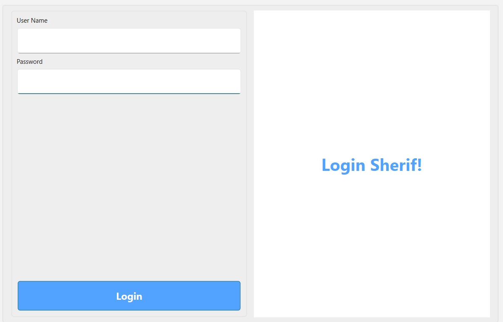
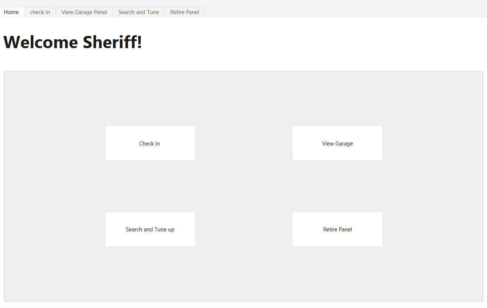
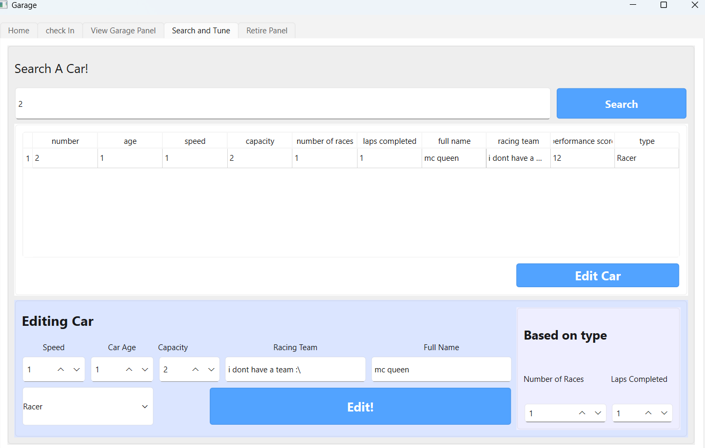
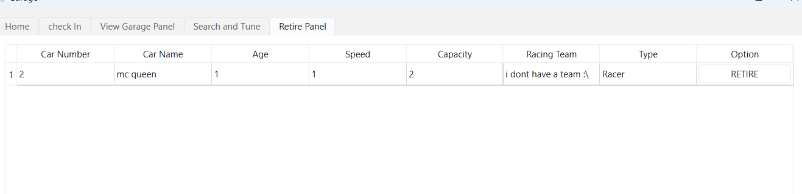

# Garage Manager

lightweight C++ desktop application built with Qt for managing your cars. Featuring an intuitive user interface and data saving to a json file.

---

###  Features

* **Modern Login Interface:** an entry point with an appealing layout.
* **Complete Garage Management:**
  * **Add:** Register new vehicles into your garage with custom parameters.
  * **Edit:** Update specs and details of existing cars on the fly.
  * **Delete:** Remove  vehicles instantly.
* **Persistent Data Storage:** All data automatically syncs to a local `JSON` file—never worry about losing your garage status when closing the app.
* **Responsive Navigation:** Seamless transitions across different views and control panels.

---

### 🛠️ Built With

* **Language:** C++
* **Framework:** Qt 6 (Widgets / Qt Designer)
* **IDE / Toolchain:** Qt Creator & Visual Studio Code (MinGW / GDB)
* **Data Format:** JSON (via `QJsonDocument`)

---

### 🚀 Quick Start

#### Prerequisites
* Qt 6.x installed with CMake or qmake support.
* C++ compatible compiler (e.g., GCC/MinGW, MSVC).

#### Building & Running

1. **Clone the repository:**
   git clone https://github.com/Abdulrahman-Mostafa53/garage-manager.git

2. **Build with CMake (VS Code / CLI)**
  
3. **Run the application:**

*(Or simply open `CMakeLists.txt` directly inside Qt Creator and hit **Ctrl + R** to run).*

---

### 📷 Application Preview

---

